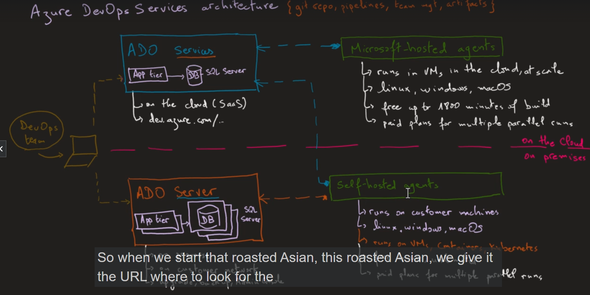

# Azure DevOps Architecture 

- we will learn  about the `architecture behind the Azure DevOps services`

- we will also learn about the `azure DevOps service component`  

- how the `Azure Devops Services` different from `Azure DevOps Server` 

**Azure DevOps Service**

- we need the  `Azure Devops Services` 
  
  - when we have the `github repo` and `azure Devops pipeline`

  - when we have `feature` for the `team management`
  
  - we can use the `Azure Devops service` to `upload the appliication package artifacts`  which will be `available for the developer`
  

- we have the `DevOps Team` connecting to their `connecting to their repective machine` and `using`  `those set up capacbilities within Azure Devops Server or Services`

- the `Devops Teams` can use the `Azure DevOps Service`  `Which is a Saas Service of Azure Devops platform` which is `an easiest option`

- here in the `SaaS service of Azure Devops` which is called the `Azure DevOps Service` which have the `App Tier` and `SQL Server DB` as a part of `Azure DevOps Service` , which is `hosted` on `Azure Cloud`  `managed by microsoft `

- the `Azure DevOps Service or SaaS service of azue DevOps` are on `cloud` , hence the `App Tier` and `SQL Server DB` will `maintained` by  `microsoft`

- **Microsoft Handled Agents**

- the `advantages` of the `Azure Devops Service` or `SaaS Service of Azure DevOps Platfor` being

  - all the `backup for the DB` and `policies` will be `managed` by the `cloud provider`

  - we can go to the [Azure DevOps Service](https://dev.azure.com/) we have the `instance of azure DevOps Services` 
  
  - when we have the `Azure DevOps Services Saas Service` then it also `create` `Microsoft Hosted agents`
  
  - these  `Microsoft Hosted agents` are the `build agaent` to run the `DevOps pipeline`  
  
  - these `build agaent` are provided by `Microsoft` hence they are called `Microsoft Hosted agents`
  
  - this `build agent` will `will run in the VM's on azure cloud on scale` , hence `microsoft` can `scale te build agents`
  
  - `Microsoft` provide those `build agent or microsoft hosted agent` for `multiple customer`
  
  - `Microsoft take care of the scaling of the build agents`
  
  - when we `requested` for the `build agent or Microsoft hosted agent`  and  `Microsft provide the Microsoft Hosted agent will be provided ` to run the `DevOps pipeline`
  
  - these `Microsoft Hosted Agent or build agent can run on any platform such as windows/linux/MacOS virtual machine`
  
  - we can run `multiple type of Build pipeline using different different OS` using the `build agents`
  
  - on a `Free Tier` these `Microsoft Host agent` can run ` 1800 minutes of the build or rlease`
  
  - we can also `paid version` for running the `Microsoft Hosted agent or Build agent`  more then `1800 minute of build/release with multiplle Parallel pipeline feature`
  
  - this `paid plan` can cost `around 20 USD`       
  
  - we can run `multiple pipeline at a time` `parallely` using the `different diffrent build agent` which been running on `different different OS VM` 
  
  - all the `Azure DevOps Services` will be `avaible on the cloud and manged by Microsoft for scaling`
  
  - these `Microsoft Hosted agents are easy to use` as they are `maintainer and scaled and upgraded by micosoft itself `

  

- **Self-Hosted Agent**

- but for `some organisation` there is `private network which exists` where they want to `perform all the provision of the infrastructure and machine, in the own private network` hence for this the `Microsoft Hosted build agent` does not make sense

- for this case we can use the `2nd type of the hosted agent` which care called the `self hosted build agent`

- the `microsoft hosted build agent`  are `hosted and managed VM done by microsoft` after `run by the microsoft managed virtual machine` on the `cloud`

- but with the `self hosted build agent` we can `deploy and run those self hosted build agent on our local customer VM` which can be in the `On a private Network`

- we can manage the `self hosted build agent` can `run on which machine`

- the `self hosted build agent being same in comparision to the microsoft hosted build agent` so that `it can also run on multiple type of OS such as Windows/MacOS/Linux`

- the `self hosted build agent` will run over the `customer VM machine which is in a prvate Network`

- we can control which `self hosted build agent can access to which machine or not` on the `on private network` 

- `self hosted build agent`  can run on the `Linux/MacOs/Windows OS`

- `self hosted build agent` can also run on `VM/container/kubernetes cluster` i.e `AKS` or `Azure`

- we can also `run` the `self hosted agent on the kubernetes cluster /container`

- if we are using the `Kubernetes cluster`  then `we can scale that` using the `KEDD` i.e `Kubernetes Event Driven Development`

- `self hosted build agent` are `free to use and unlimited`  

- we will have to have the `paid plan` for running `multiple self hosted agent on different different VM parallely`

- **Azure DevOps Server**   

  - here `another usage` is to iuse the `Azure DevOps Server`
  
  - the main difference between  `Azure DevOps Server` and  `Azure DevOps Service` being `Azure Devops being cloud Hosted service` where as the `Azure DevOps Server` we will have to `run on our own virtual machine which can be on a private network infrastructure`
  
  - the `Azure DevOps Server` being required when `we want to run the build agent on the Own infrastructure on Own Private Network using customer VM machine`
  
  - the `Azure Devops Server` will `run` on  `on -premises` and `VM are hosted in the Customer Network to use the build agent`
  
  - As it is on the `customer private network` hence the `customer` need to `manage` `backup and upgrade and scale the VMS`
  
  - or we can use the `Azure DevOps Admin console` for this , which is a `App tier` application 
  
  - we need to `install` the `Azure DevOps Admin Console` along with `Azure DevOps Server` on the `VM present in  customer private network`  
  
  - we can use a `single windows VM server` on which we can install the `Azure DevOps Server` and  `Azure DevOps Admin Console`
  
  - or we can create `multiple custom VM on private network` on which we can install different different `Azure DevOps Server` and  `Azure DevOps Admin Console`  but have `App Tier running on a VM Sever` and `SQL DB running on another VM Server` in order to chive `High Availability`
  
  - we can also have `More Than 2 VM` where we want to install the   `Azure DevOps Server` and  `Azure DevOps Admin Console` and run it with `App Tier` and `SQL DB` on the `same VM`
  
  - with `Azure DevOps Server` we can't connect to the `Microsoft hosted build agent`
  
  - but we can `connect`from the `Self Hosted Build agent` to the `Azure DevOps Server` or `Azure DevOps Service hosted in cloud` 
  
  - when we `connect and use` the `self hosted build against the Azure DevOps Server running on the private Network`
  
  - we can `install the self hosted build agent` inside the `Custom VM on which Azure DevOps Server and Azure DevOps Admin Console being installed`
  
  - but we need to make sure `Azure DevOps` have the access to the `self hosted build agent`
  
  - the `communication` between the `self hosted build agent` to the `Azure Development Server/ Service` will be always in a `backward direction`

  - i.e `self hosted agent` will try to fetch `Azure DevOps Server/Services`
  
  - we will be providing the `self hosted build agent` the `url` of the `Azure DevOps Server/ Azure DevOps Services` 

  - 